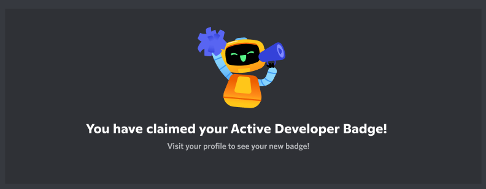

<p align="center">
    
    <br>
  
<p align="center">
    Бот для получения значка активного разработчика в Discord
</p>

<p align="center">
  
  </p>
  
# 🕵️ Что это?
 По задумке дискорда значок должен был выдаваться некоторым разработчикам за их упортсво и тяжёлый труд , но что то пошло не так и он стал доступен для всех пользователей.


### 📢 Объявление: Discord введет 30-дневную проверку активности для активных разработчиков, начиная с января 2023 года. Существующие активные разработчики сохранят значок, а новые разработчики по-прежнему могут претендовать на значок активного разработчика.

# 1.Тутор по установке (для .exe не обязательно)
## Для начала убедитесь что у вас версия  Python 3.10 и выше 
После его установки Python, запускаем командную строку и пишем следуйщие команды:
```py
pip install colorama
```
```py
pip install discord.py
```
```py
pip install requests
```
# 2.Подготовка к запуску
### Дальше следуем по инструкции.
Создаем сервер > Включаем сообщество 

## Заходим на сайт  https://discord.com/developers/applications
### Создаём новое приложение > Нажимаем на приложение > Переходим слева в котолог ```Bot```
### Нажимаем ```Reset Token``` (может попросить код 2FA) > Сохраняем токен в надежном месте

# 3.Запуск приложения
## Открываем main.py или dbadge.exe
### В открывшееся окно вставьте токен вашего бота, который вы копировали перед этим.
### Как только бот залогинился перейдите по полученной ссылке и пригласите бота на свой Сервер Сообщества.
### Зайдите на свой сервер в Дискорде и введите команду ```/getbadge``` в любом канале.
### Откройте https://discord.com/developers/active-developer и заберите свой значок. (Возможность забрать значок должна появиться в течение 24 часов).


